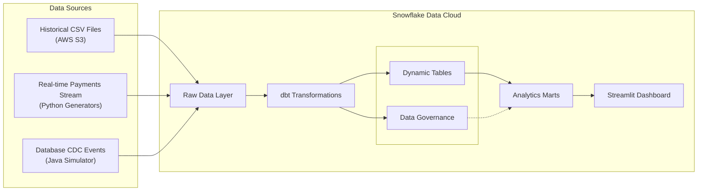

# 🏦 FSI Demo - Snowflake Financial Services Platform

A concise demonstration of Snowflake’s data platform for financial services: ingestion, transformation, governance, visualization, and analytics.

## 🏆 Business Value Delivered
✅ **Real-time Insights** - Live transaction monitoring and anomaly detection  
✅ **Operational Efficiency** - Automated data pipelines and transformations  
✅ **Enhanced Security** - Role-based access and principle of least privilege
✅ **Reduced Compliance Risk** - Automatic PII masking and governance  
✅ **Scalable Architecture** - Cloud-native, elastic compute and storage  

## 🛠 Technology Stack

- **☁️ Storage**: AWS S3 + Iceberg + Snowflake managed storage
- **📡 Real-time Streaming**: Python + Java (Snowpipe Streaming SDK)
- **🔄 Transformations**: dbt Core (Snowflake-native execution)
- **🔒 Governance**: RBAC + Dynamic PII Masking Policies
- **📊 Analytics**: Streamlit + Plotly (interactive dashboards)
- **🤖 ML/AI**: Snowflake ML/AI in SNowflaek Notebooks

## 🧭 Architecture & Lineage



## ✨ Key Features (In Demo Order)

- **Ingestion**: Batch from S3, Python generators, and Java CDC streaming
- **Transformation**: dbt staging (views in `TRANSFORMED`) and marts (tables in `ANALYTICS`)
- **Governance**: Strict PII masking policies (only `data_steward` unmasked), least-privilege roles
- **Visualization**: Native Streamlit app in `ANALYTICS` schema
- **Analytics**: Customer 360, transaction summaries, simple insights


## 📊 Data Model

**🏦 Customer Data** (5,000 customers)
- Customer profiles with PII (masked for compliance)
- 1:1 mapping to mortgage applications
- Realistic customer tier distribution

**🏠 Mortgage Data** (4,800 applications)
- Loan details from AWS S3 external stage
- Iceberg table format for performance
- Real loan application attributes

**💳 Transaction Data** (200,000+ historical + real-time)
- FSI transaction types (leisure, lifestyle, etc.)
- CDC streaming with INSERT/UPDATE/DELETE
- Statistical patterns for anomaly detection


## 👥 User Personas & Roles

| Role | Access Level | Purpose |
|------|-------------|---------|
| **`data_steward`** | 🟢 Full PII Access | Governance oversight, compliance monitoring |
| **`data_analyst_role`** | 🔒 Masked PII | Dashboard users, business analytics |
| **`ACCOUNTADMIN`** | 🔒 Masked PII | System administration (enhanced security) |


## 🚀 Quick Start

### Prerequisites
- Python 3.8+
- Snowflake account with ACCOUNTADMIN access
- Snowflake CLI configured with key-pair authentication

### Installation & Setup
```bash
# Clone repository
git clone https://github.com/sfc-gh-nfernandezmartinez/fsi_demo.git
cd fsi_demo

# Install Python dependencies
pip install -r requirements.txt
```

### 🎯 Deployment Steps (use in your live demo)
1) Foundation
```sql
@sql/01_foundation_setup.sql
```

2) Ingestion (tables and data)
```sql
@sql/02_ingestion_setup.sql
```

3) CDC Streaming Setup (optional for demo)
```sql
@sql/03_cdc_streaming_setup.sql
```

4) Governance (strict masking policies and RBAC)
```sql
@sql/04_governance.sql
```

## Usage

**Generate Data:**
```bash
# Generate customer data (5,000 customers)
python stream_demo.py customers

# Generate historical transactions (200,000 records)
python stream_demo.py historical

# Start real-time streaming
python stream_demo.py start
```

**Java CDC Streaming:**
```bash
cd java_streaming
# Build and run FSI event streamer
mvn compile exec:java -Dexec.mainClass="CDCSimulatorApp"
```

**5. Deploy dbt Models (Snowflake native):**
```bash
# In Snowflake Workspaces, execute dbt project
execute dbt project from workspace USER$.PUBLIC.fsi_demo project_root='/dbt' args='run --target dev'
```

**6. Deploy Streamlit Dashboard:**
```bash
cd streamlit_app
snow streamlit deploy --replace
# Access at: FSI_DEMO.ANALYTICS.FSI_ANALYTICS_DASHBOARD
```

## 📁 Clean Project Structure
```
fsi_demo/
├── sql/                           # Idempotent setup scripts
│   ├── 01_foundation_setup.sql    # Warehouses, roles, schemas
│   ├── 02_ingestion_setup.sql     # Tables, data loading
│   ├── 03_cdc_streaming_setup.sql # CDC streaming demo
│   └── 04_governance.sql          # PII masking, RBAC
├── dbt/                           # Data transformation pipeline
│   ├── models/staging/            # Clean, standardized views
│   ├── models/marts/              # Business-ready tables
│   ├── dbt_project.yml            # dbt configuration
│   └── profiles.yml               # Snowflake connection
├── streaming/                     # Python data generators
│   ├── customer_generator.py
│   ├── transaction_generator.py
│   ├── historical_generator.py
│   └── simple_realtime_streamer.py
├── java_streaming/                # Java CDC streaming
│   ├── CDCSimulatorClient.jar
│   ├── src/snowflake/demo/samples/FSIEventStreamer.java
│   └── snowflake.properties
├── streamlit_app/                 # Native Streamlit app
│   ├── streamlit_app.py
│   ├── snowflake.yml
│   └── environment.yml
├── guides/                        # Demo documentation
│   ├── 01_Project_Architecture.md
│   ├── 02_Data_Pipeline.md
│   └── 03_Analytics_Transformation.md
└── stream_demo.py                 # CLI for data generation
```

## 📖 Documentation

See `guides/` for detailed runbooks:
- `01_Ingestion.md` — batch from S3, generated customers, CDC streaming
- `02_Transform.md` — dbt native in Snowflake, staging → marts
- `03_Governance.md` — masking policies, RBAC, notes on DMFs/audit
- `04_Visualization.md` — Streamlit in Snowflake with SnowCLI
- `05_ML_AI.md` — planned ML/AI enhancements (anomaly detection)

## 🤝 Contributing

This is a demonstration project showcasing Snowflake capabilities for financial services. For questions or suggestions, please open an issue.

## 📄 License

MIT License - see LICENSE file for details.

---

**🏦 Built by Snowflake for Financial Services Innovation**  
*Demonstrates: PII Masking • Real-time Analytics • ML Integration • Enterprise Governance*