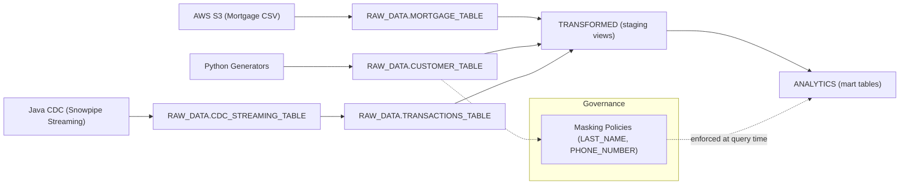

# 🏗️ FSI Demo - Project Architecture

## 🏦 Project Purpose
Banking FSI demonstration platform showcasing Snowflake's capabilities for financial services, including real-time streaming, data governance, transformations, and analytics.

## 🏗️ Data Architecture & Lineage


### 3-Layer Data Strategy
- **RAW_DATA**: Raw ingestion zone (external stages, streaming data)
- **TRANSFORMED**: Cleaned, normalized data (dbt staging views)  
- **ANALYTICS**: Business-ready tables and ML features (dbt marts)

## 👥 User Personas & Access
- **data_engineer**: Data ingestion and pipeline management
- **data_analyst**: Transformations and business intelligence (PII masked)
- **SYSADMIN**: Data steward functions and governance
- **fsi_automation_service**: Service account for automation

## 💰 FinOps Warehouse Strategy

### Workload-Optimized Warehouses
```sql
INGESTION_WH_XS     (X-SMALL) - Streaming/batch, 30s auto-suspend
TRANSFORMATION_WH_S (SMALL)   - dbt models, 60s auto-suspend  
ANALYTICS_WH_S      (SMALL)   - BI/dashboards, 300s auto-suspend
ML_WH_M            (MEDIUM)   - Data science, manual control
DEV_WH_XS          (X-SMALL) - Development, 60s auto-suspend
```

### Cost Optimization Benefits
- **Clear cost attribution** per workload type
- **Right-sizing** for each usage pattern
- **Workload isolation** prevents interference
- **Predictable budgeting** with function-based forecasting

## 🛡️ Security & Governance

### Role Hierarchy
```
ACCOUNTADMIN
├── SYSADMIN (data steward functions)
    ├── data_engineer_role
    └── data_analyst_role
```

### PII Masking Strategy (Strict)
- **LAST_NAME**: Full masking (`***`) for non-stewards
- **PHONE_NUMBER**: Partial masking (`***-***-1234`) for non-stewards
- **Access Control**: Only `data_steward` sees unmasked data

## 📊 Data Model
- **CUSTOMER_TABLE**: 5,000 customers (1001-6000) with 1:1 mortgage mapping
- **MORTGAGE_TABLE**: Loan applications with debt-to-income ratios
- **TRANSACTIONS_TABLE**: 200k+ historical + real-time streaming transactions
- **CDC_STREAMING_TABLE**: High-throughput streaming in CDC format

## 🔧 Technology Stack
- **Data Platform**: Snowflake (native dbt, Streamlit, Iceberg)
- **Authentication**: Key-pair for services, role-based access
- **Development**: Python generators, Java CDC simulator
- **Storage**: AWS S3 with external volumes
- **Git Integration**: Snowflake Workspaces + GitHub

## 🚀 Foundation Setup

### Idempotent Deployment
```sql
-- Run foundation setup
snow sql --filename fsi_demo/sql/01_foundation_setup.sql

-- Verify deployment
SHOW WAREHOUSES LIKE '%_WH_%';
SHOW ROLES LIKE 'data_%_role';
```

### Key Benefits
- **CREATE OR ALTER**: Idempotent, can be re-run safely
- **DevOps Ready**: Version controlled, environment agnostic
- **Cost Optimized**: Right-sized warehouses with appropriate auto-suspend
- **Security First**: Least privilege access model

This architecture demonstrates enterprise-grade patterns for financial services data platforms with cost optimization and governance built-in.
